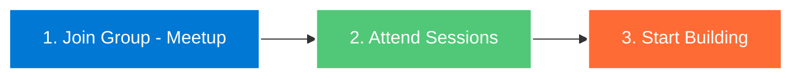

<div align="center">

# ☁️ Azure Nigeria Community

### Building Cloud Skills Across Nigeria

[](https://rebrand.ly/azurenigcommunity-meetup)
[](https://rebrand.ly/azurenig-twitter)
[](https://rebrand.ly/azurenigcommunity-linkedin)


</div>

---

## 🎯 What We Do

We teach Azure through hands-on practice. Our training sessions focus on:

```
🎓 **Instructor-Led Training** - Regular hands-on workshops covering Azure fundamentals to advanced services  
🚀 **Real-World Projects** - Practical experience building solutions with Azure technologies  
🤝 **Networking & Collaboration** - Connect with fellow developers and industry professionals  
📚 **Knowledge Sharing** - Learn from experienced Azure practitioners and Microsoft MVPs  
🎯 **Career Development** - Prepare for Azure certifications and cloud career opportunities
```

<div align="center">

### 🚀 Our Focus Areas

</div>

<table>
<tr>
<td width="33%" align="center">

<br><strong>Cloud Computing</strong>
<br>Master Azure fundamentals and advanced services
</td>
<td width="33%" align="center">

<br><strong>Real Projects</strong>
<br>Build and deploy actual applications
</td>
<td width="33%" align="center">

<br><strong>Community</strong>
<br>Network with Nigerian cloud Developers and Engineers
</td>
</tr>
</table>

---

## 👥 Who Should Join

<details open>
<summary><b>🎓 Students & Learners</b></summary>
<br>
New to cloud? Start here. We cover the basics and get you building fast.
</details>

<details open>
<summary><b>💻 Developers</b></summary>
<br>
Ready to add cloud skills? Learn Azure services used in real production environments.
</details>

<details open>
<summary><b>🔧 IT Professionals</b></summary>
<br>
Moving to Azure? Get practical experience managing cloud infrastructure.
</details>

<details open>
<summary><b>🚀 Career Switchers</b></summary>
<br>
Curious about Cloud computing? No prerequisites—show up willing to learn.
</details>

---

## 💡 How We Help You

| Feature | What You Get |
|---------|-------------|
| 🎓 **Monthly Training** | Instructor-led workshops on Azure services |
| 🛠️ **Project Support** | Help building your Azure applications |
| 📚 **Certification Prep** | Study groups for Azure exams |
| 💼 **Job Network** | Companies hiring from our community |
| 💬 **Direct Access** | Ask questions, get answers from experienced members |

---

## 🎯 Get Started in 3 Steps



<div align="center">

### 📅 Upcoming Events

Check our [Meetup page](https://rebrand.ly/azurenigcommunity-meetup) for the latest workshops and training sessions

</div>

---

## 🤝 Ways to Participate

- ✅ Attend workshops and training sessions
- ❓ Ask questions when you're stuck
- 🎨 Share your projects and knowledge with the group
- 🆘 Help newcomers get started
- 💡 Suggest topics you want to learn

---

## 📫 Connect With Us

<div align="center">

| Platform | Link |
|----------|------|
| 📅 **Meetup** | [Join our events](https://rebrand.ly/azurenigcommunity-meetup) |
| 🐦 **Twitter/X** | [@AzureNigeria](https://rebrand.ly/azurenig-twitter) |
| 💼 **LinkedIn** | [Azure Nigeria Community](https://rebrand.ly/azurenigcommunity-linkedin) |
| 📧 **Email** | hello@azurenigeria.community |

</div>

---

## 📊 Community Stats

<div align="center">


</div>

---

## 🌟 Featured Projects

Showcase projects built by community members:

> Coming soon! Build something with Azure and we'll feature it here.

---

## 📜 Code of Conduct

We maintain a welcoming, inclusive environment. Respect everyone, ask questions freely, and help others learn.

---

<div align="center">

### 💙 Learning Azure. Building Careers. Growing Together.

**Made with ❤️ in Nigeria 🇳🇬**

⭐ Star this repo to stay updated | 👀 Watch for new resources

</div>